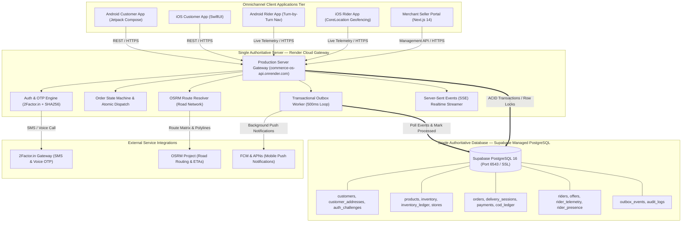

# CommerceOS Unified System Architecture

## 1. High-Level System Topology



---

## 2. End-to-End Request Lifecycle

```mermaid
sequenceDiagram
    autonumber
    actor Customer as Customer (iOS / Android)
    participant Render as Render Cloud Gateway
    participant Supabase as Supabase PostgreSQL
    participant TwoFactor as 2Factor.in SMS / Voice
    participant Rider as Rider App

    Customer->>Render: POST /api/v1/auth/otp/send (Phone Number)
    Render->>Supabase: INSERT INTO auth_challenges (challengeId, otpHash, expiresAt)
    Render->>TwoFactor: Dispatch SMS & Voice Call with OTP
    TwoFactor-->>Customer: User receives 6-digit verification code

    Customer->>Render: POST /api/v1/auth/otp/verify (OTP + challengeId)
    Render->>Supabase: Verify hash & SELECT / INSERT customers
    Render-->>Customer: 200 OK with JWT Token + Unified userId

    Customer->>Render: POST /api/v1/customers/:id/addresses (Address Details)
    Render->>Supabase: INSERT INTO customer_addresses (persisted in Postgres)
    Render-->>Customer: 201 Created (Address successfully saved in Supabase)

    Customer->>Render: POST /api/v1/orders (Checkout with Address & Cart)
    Render->>Supabase: BEGIN; Lock stock; INSERT orders; INSERT outbox_events; COMMIT
    Render-->>Customer: 201 Order Confirmed
    Render->>Rider: SSE Dispatch Event (Broadcasting offer within 10km)

    Rider->>Render: POST /api/v1/delivery/offers/:id/accept
    Render->>Supabase: SELECT ... FOR UPDATE; Assign Rider; UPDATE delivery_sessions
    Render-->>Rider: 200 Assigned
    Render-->>Customer: SSE Event: Order Status -> ASSIGNED (Live rider tracking active)
```

---

## 3. Component Specification Table

| Tier | Component | Host / Runtime | Role & Technology |
| :--- | :--- | :--- | :--- |
| **Server** | **`commerce-os-api`** | Render (`singapore`) | Single authoritative backend gateway running `node platform/server/production-server.js`. |
| **Database** | **Supabase DB** | Supabase AWS (`ap-northeast-2`) | Single authoritative PostgreSQL 16 cluster (`aws-0-ap-northeast-2.pooler.supabase.com:6543/postgres`). |
| **Client** | **Customer Android** | Android 8.0+ | Native Kotlin app using Jetpack Compose, Retrofit, and EncryptedSharedPreferences pointing to Render. |
| **Client** | **Customer iOS** | iOS 17.0+ | Native Swift app using SwiftUI, MapKit, VisionKit OCR, and Passkeys pointing to Render. |
| **Client** | **Rider Android** | Android 8.0+ | Native Kotlin courier app with turn-by-turn navigation and 50m arrival geofencing. |
| **Client** | **Rider iOS** | iOS 17.0+ | Native Swift courier app with CoreLocation circular geofence auto-arrival and dead reckoning. |
| **Client** | **Seller Portal** | Next.js 14 | Web application with dark store order dispatching, packing workflow, and SKU catalog management. |
| **External** | **2Factor.in** | Cloud API | Dual SMS and Voice Call OTP carrier gateway. |
| **External** | **OSRM Project** | Cloud API | OpenStreetMap routing engine for real-world road network driving distances and ETAs. |
